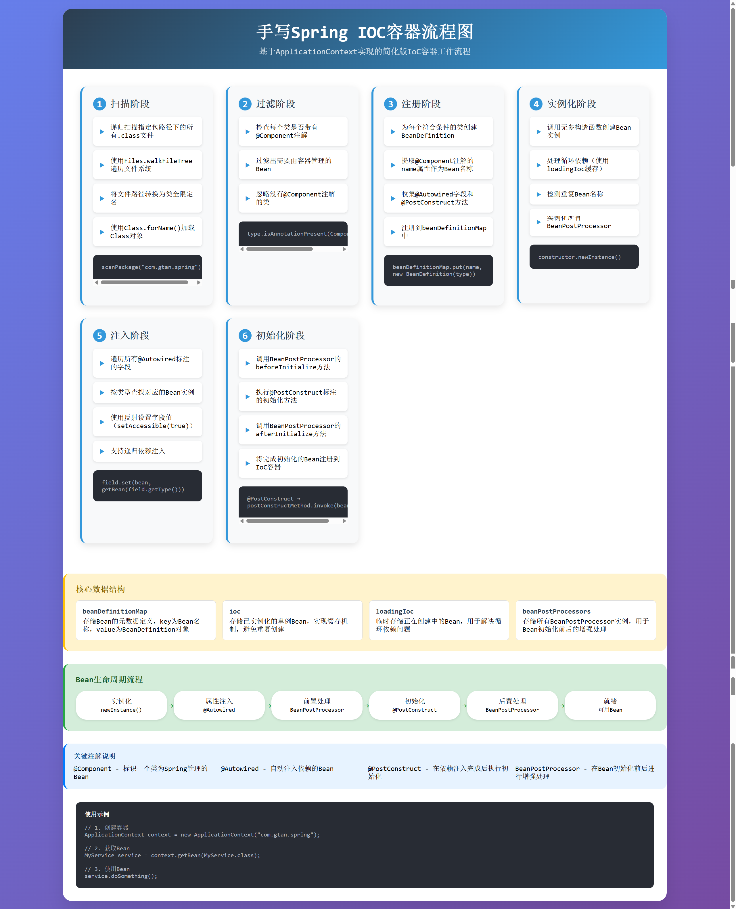
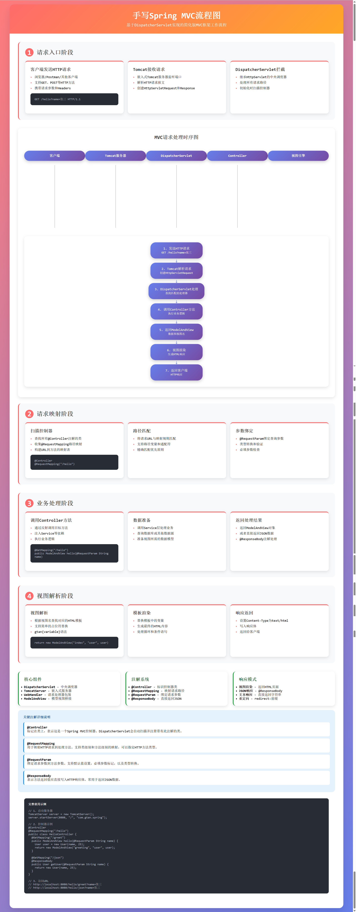

# 手写Spring框架

本项目是一个手写简化版的Spring框架，完整实现了IoC容器和MVC框架的核心功能。通过纯Java代码实现了Spring的核心机制，帮助理解Spring框架的底层原理。

## 项目特性

- **IoC容器**: 实现ApplicationContext，支持组件扫描、依赖注入、生命周期管理
- **MVC框架**: 实现DispatcherServlet，支持请求映射、参数绑定、视图解析
- **拦截器机制**: 实现完整的拦截器链，支持前置、后置、完成三种拦截点
- **注解驱动**: 支持@Component、@Controller、@Autowired等核心注解
- **嵌入式服务器**: 集成Tomcat，一键启动Web应用

## 架构概览

### IoC容器流程图


### MVC框架流程图


##️ IoC容器实现

### 核心组件

#### ApplicationContext
- **功能**: IoC容器的核心实现
- **职责**: 组件扫描、Bean实例化、依赖注入、生命周期管理
- **数据结构**:
  - `beanDefinitionMap`: 存储Bean元数据定义
  - `ioc`: 存储已实例化的单例Bean
  - `loadingIoc`: 解决循环依赖的临时缓存
  - `beanPostProcessors`: Bean后置处理器列表

#### BeanDefinition
- **功能**: Bean的元数据封装
- **内容**: 类类型、Bean名称、构造函数、依赖字段、初始化方法
- **构建**: 通过反射扫描@Component注解类自动生成

#### BeanPostProcessor
- **功能**: Bean初始化前后增强处理
- **方法**: beforeInitializeBean()、afterInitializeBean()

### 工作流程

```
启动流程：
1. 扫描指定包下所有.class文件
2. 过滤带有@Component注解的类
3. 创建BeanDefinition并注册
4. 实例化所有BeanPostProcessor
5. 创建并初始化所有Bean
6. 完成容器启动

Bean生命周期：
实例化 → 属性注入 → 前置处理 → 初始化 → 后置处理 → 就绪
```

### 使用示例

```java
// 1. 创建IoC容器
ApplicationContext context = new ApplicationContext("com.gtan.spring");

// 2. 获取Bean实例
MyService service = context.getBean(MyService.class);

// 3. 使用Bean
service.doBusiness();
```

## MVC框架实现

### 核心组件

#### DispatcherServlet
- **功能**: 中央调度器，所有请求的入口
- **职责**: 请求分发、参数绑定、视图解析、响应生成、拦截器链执行
- **继承**: HttpServlet，处理所有HTTP请求
- **拦截器**: 支持前置(preHandle)、后置(postHandle)、完成(afterCompletion)三种拦截点

#### TomcatServer
- **功能**: 嵌入式Tomcat服务器
- **配置**: 一键启动，支持端口和路径配置

#### ModelAndView
- **功能**: 模型和视图的桥梁
- **内容**: 视图名称、数据模型、响应类型

#### Interceptor & InterceptorRegistry
- **功能**: 拦截器机制的核心实现
- **职责**: 请求预处理、后处理、完成处理
- **注册**: 通过@Component注解自动注册到InterceptorRegistry

### 请求处理流程

```
完整流程：
1. 客户端发送HTTP请求
2. Tomcat服务器接收并解析
3. DispatcherServlet拦截所有请求
4. 执行拦截器链(preHandle)
5. 查找匹配的@Controller和@RequestMapping
6. 绑定请求参数到方法参数
7. 调用Controller方法执行业务逻辑
8. 执行拦截器链(postHandle)
9. 返回ModelAndView或JSON数据
10. 视图引擎渲染页面
11. 执行拦截器链(afterCompletion)
12. 生成HTTP响应返回客户端
```

### 支持的响应模式

- **视图渲染**: 返回HTML页面，使用模板引擎
- **JSON响应**: 使用@ResponseBody直接返回JSON
- **文本响应**: 直接返回字符串内容
- **重定向**: 支持redirect:前缀

### 使用示例

```java
@Controller
@RequestMapping("/user")
public class UserController {
    
    @Autowired
    private UserService userService;
    
    // 返回视图页面
    @GetMapping("/profile")
    public ModelAndView getProfile(@RequestParam Long id) {
        User user = userService.findById(id);
        return new ModelAndView("profile", "user", user);
    }
    
    // 返回JSON数据
    @GetMapping("/info")
    @ResponseBody
    public User getUserInfo(@RequestParam Long id) {
        return userService.findById(id);
    }
}
```

##️ 核心注解

### IoC注解
- **@Component**: 标记为Spring管理的组件
- **@Autowired**: 自动注入依赖
- **@PostConstruct**: 初始化回调方法

### MVC注解
- **@Controller**: 标记为MVC控制器
- **@RequestMapping**: 请求路径映射
- **@GetMapping/@PostMapping**: HTTP方法映射
- **@RequestParam**: 请求参数绑定
- **@ResponseBody**: 直接返回响应体

### 拦截器相关
- **@Component**: 拦截器类标记为组件，自动注册到拦截器链
- **Interceptor接口**: 实现preHandle/postHandle/afterCompletion方法

## 快速开始

### 1. 启动应用
```java
public class Application {
    public static void main(String[] args) throws Exception {
        // 启动IoC容器和MVC服务器
        TomcatServer server = new TomcatServer();
        server.startServer(8080, "/", "com.gtan.spring");
        
        System.out.println("服务器启动成功！访问 http://localhost:8080");
    }
}
```

### 2. 创建控制器
```java
@Controller
public class HelloController {
    
    @GetMapping("/hello")
    public ModelAndView hello(@RequestParam String name) {
        return new ModelAndView("hello", "name", name);
    }
    
    @GetMapping("/api/hello")
    @ResponseBody
    public Map<String, String> apiHello(@RequestParam String name) {
        return Map.of("message", "Hello, " + name);
    }
}
```

### 3. 创建服务类
```java
@Component
public class UserService {
    
    public User findById(Long id) {
        // 模拟数据库查询
        return new User(id, "张三", 25);
    }
}
```

## 项目结构

```
src/main/java/com/gtan/spring/
├── annotation/          # 核心注解定义
│   ├── Component.java
│   ├── Controller.java
│   ├── RequestMapping.java
│   ├── RequestParam.java
│   ├── ResponseBody.java
│   └── Autowired.java
├── controller/          # 示例控制器
│   └── HelloController.java
├── interceptor/         # 拦截器实现
│   ├── Interceptor.java         # 拦截器接口
│   └── InterceptorRegistry.java # 拦截器注册中心
├── service/            # IoC容器实现
│   ├── ApplicationContext.java
│   ├── BeanDefinition.java
│   └── BeanPostProcessor.java
├── web/                # MVC框架实现
│   ├── DispatcherServlet.java
│   ├── TomcatServer.java
│   ├── WebHandler.java
│   └── ModelAndView.java
├── entity/             # 实体类
│   └── User.java
└── enumeration/        # 枚举类
    └── ResultType.java

src/main/resources/
├── index.html         # 示例页面
├── ioc-flowchart.png  # IoC流程图
└── mvc-flowchart.png  # MVC流程图
```

## 技术栈

- **Java 21**: 核心语言
- **Tomcat 10**: 嵌入式Web服务器
- **FastJSON**: JSON序列化
- **反射机制**: 运行时类处理
- **注解处理**: 元数据驱动配置

## 学习价值

通过本项目可以深入理解：
- Spring IoC容器的实现原理
- Spring MVC的请求处理机制
- 注解驱动开发的底层实现
- 反射和动态代理的实际应用
- Web服务器的嵌入和配置

##️ 拦截器机制

### 核心概念

拦截器机制实现了类似Spring MVC的拦截器功能，支持在请求处理的不同阶段进行拦截处理。

#### 拦截器接口 (Interceptor)
```java
public interface Interceptor {
    boolean preHandle(HttpServletRequest request, HttpServletResponse response, 
                     WebHandler handler) throws Exception;
    
    void postHandle(HttpServletRequest request, HttpServletResponse response,
                   WebHandler handler, ModelAndView modelAndView) throws Exception;
    
    void afterCompletion(HttpServletRequest request, HttpServletResponse response,
                        WebHandler handler, Exception exception) throws Exception;
}
```

#### 三种拦截点
1. **preHandle**: 在Controller方法执行前调用，可用于权限验证、日志记录
2. **postHandle**: 在Controller方法执行后，视图渲染前调用，可用于修改模型数据
3. **afterCompletion**: 在整个请求完成后调用，可用于资源清理、性能监控

### 自动注册机制

拦截器通过IoC容器的组件扫描机制自动注册：
- 实现`Interceptor`接口的类使用`@Component`注解标记
- 在`ApplicationContext`初始化时自动注册到`InterceptorRegistry`
- 支持多个拦截器，按注册顺序执行

### 使用示例

#### 1. 创建自定义拦截器
```java
@Component
public class MyInterceptor implements Interceptor {
    
    @Override
    public boolean preHandle(HttpServletRequest request, HttpServletResponse response, 
                            WebHandler handler) {
        System.out.println("请求URI: " + request.getRequestURI());
        System.out.println("请求方法: " + request.getMethod());
        return true; // 返回false则中断请求
    }
    
    @Override
    public void postHandle(HttpServletRequest request, HttpServletResponse response,
                          WebHandler handler, ModelAndView modelAndView) {
        System.out.println("Controller执行完成，准备渲染视图");
    }
    
    @Override
    public void afterCompletion(HttpServletRequest request, HttpServletResponse response,
                               WebHandler handler, Exception exception) {
        System.out.println("请求处理完成，执行清理工作");
    }
}
```

#### 2. 启动应用
```java
public class Application {
    public static void main(String[] args) throws Exception {
        TomcatServer server = new TomcatServer();
        server.startServer(8080, "/", "com.gtan.spring");
        
        // 所有实现Interceptor接口的类将自动注册
        System.out.println("服务器启动成功！拦截器已自动注册");
    }
}
```

### 拦截器执行流程

```
请求处理流程（含拦截器）：
1. 客户端发送HTTP请求
2. DispatcherServlet接收请求
3. 执行所有拦截器的preHandle方法
   └─ 如果任一拦截器返回false，请求中断
4. 查找匹配的@Controller和@RequestMapping
5. 绑定请求参数到方法参数
6. 执行Controller方法
7. 执行所有拦截器的postHandle方法（逆序）
8. 视图引擎渲染页面
9. 执行所有拦截器的afterCompletion方法（逆序）
10. 生成HTTP响应返回客户端
```

## 扩展方向

- 支持AOP切面编程
- 实现事务管理
- 支持更多注解@PathVariable、@RequestBody
- 集成数据库ORM框架
- 支持WebSocket通信
- 实现拦截器路径匹配过滤
- 添加拦截器优先级配置

## 许可证

MIT License - 详见LICENSE文件